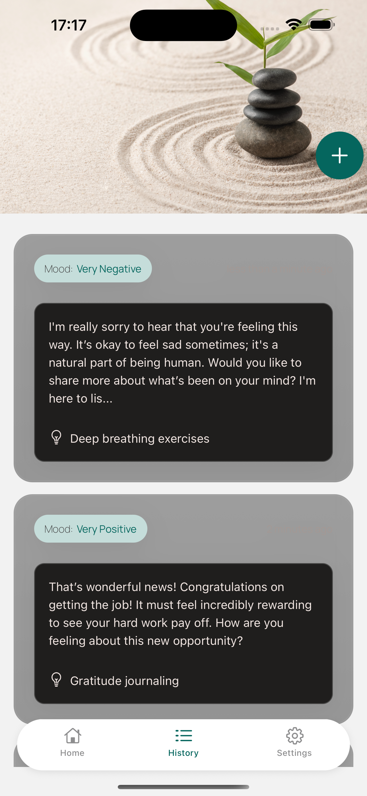
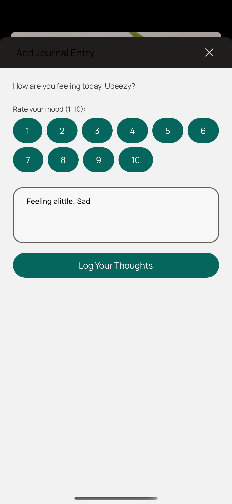
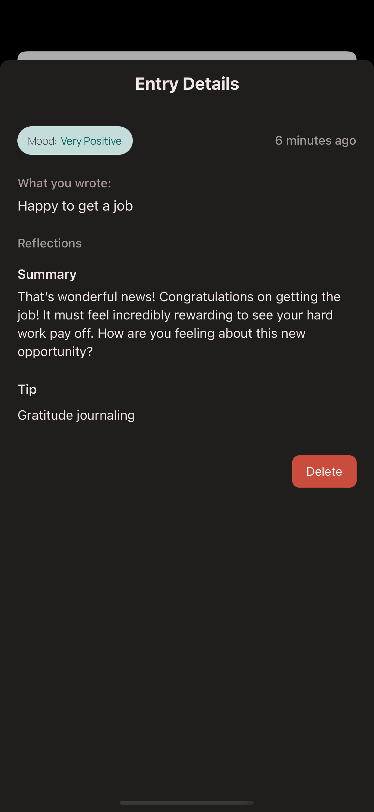
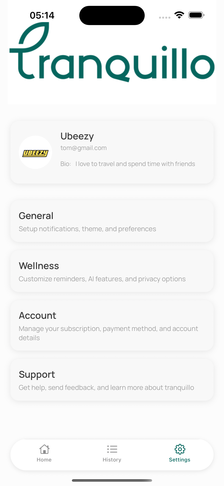

**Tranquillo** is a beautiful minimalistic mobile journaling app designed to help you gain mental clarity, build self-awareness, and track your emotional well-being. Built using **React Native**, **Expo**, and **Supabase**, it features a calm, glassy UI with secure authentication and real-time storage.

## ✨ Features

- 🧘‍♀️ **Daily Mood Tracking** – Reflect on moods like anxious, excited, tired, and more.
- 📓 **Journaling** – Write daily entries to process your thoughts, feelings, and progress.
- 🧠 **Wellness-Themed Colors** – Soothing dark theme with emotion-based palettes.
- 🔒 **Auth via Supabase** – Secure email-based login and session management.
- 🖼 **Avatar Uploads** – Clean glass UI with avatar upload to Supabase Storage.
- 🔍 **Blurred Cards & UI** – Native glassmorphism using `expo-blur` and `react-native`.
- ⚛️ Built using **React Native + Expo Router**

## 📱 Screenshots

| Onboard                       | Login                        | History                        | Journal Entry                      | Edit Journal                        | Profile                        |
| ---------------------------- | --------------------------- | ------------------------------ | ---------------------------------- | ----------------------------------- | ------------------------------ |
|  |  |  |  |  |  |

## 🛠️ Tech Stack

| Tech                                                              | Purpose                                  |
| ----------------------------------------------------------------- | ---------------------------------------- |
| [Expo](https://expo.dev/)                                         | App scaffolding, build, and deployment   |
| [React Native](https://reactnative.dev/)                          | Core framework for native UI             |
| [Supabase](https://supabase.com/)                                 | Backend as a service (Auth, DB, Storage) |
| [TheraApi](https://www.theraapi.com/)                        | Powerful APIs for Mental Wellness          |

## ⚙️ Installation

### 1. Clone the repo

```bash
git clone https://github.com/jeffubayi/tranquillo.git

cd tranquillo
```

### 2. Install dependencies

```bash
npm install
```

### 3. Set up environment variables

Create a .env file in the root:

```bash
SUPABASE_URL=https://your-project.supabase.co

SUPABASE_ANON_KEY=your-anon-key
```

### 4. Run the app

```bash
npx expo start
```

Then scan the QR code using your device, or use Android/iOS simulator.


## 📦 Dependencies Overview

- expo, react-native, expo-router

- @supabase/supabase-js

- expo-blur, expo-image-picker

- clsx for conditional class merging

- @expo/vector-icons for consistent icons

## 🚀 Deployment

You can build the app with Expo:

```bash

npx expo build:android

npx expo build:ios
```

Or use EAS Build for advanced workflows.
